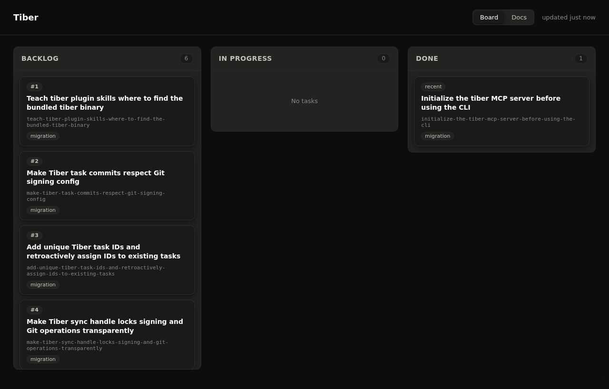
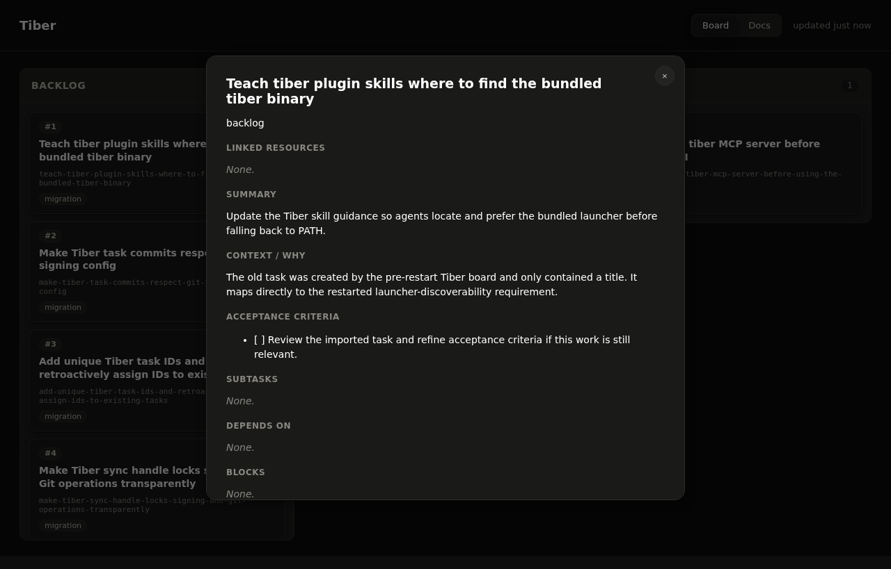
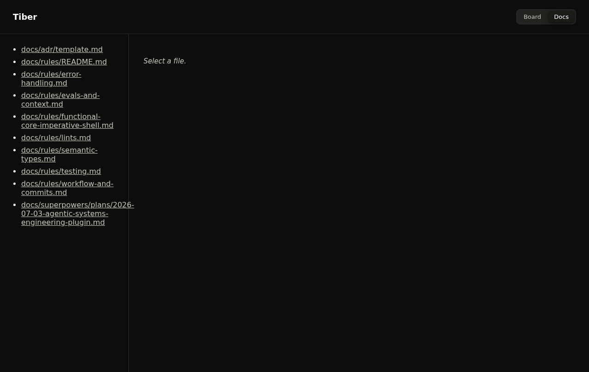

# Tiber

Tiber is a Git-backed task board for coding agents. It keeps task state in
Tiber-owned Git storage and gives agents a deterministic CLI plus stdio MCP
tools for creating, ordering, validating, and closing repository-local work.

The goal is simple: multiple agents and worktrees can coordinate without turning
task files into untracked side chatter or hand-edited markdown drift.

## Screenshots

These screenshots were captured from this repository after initializing Tiber and
creating the top-level tasks for the rename/merge work.







## Quick Start

```shell
tiber init
tiber create "Document release checklist"
tiber list
tiber show document-release-checklist
tiber validate --fix
tiber sync
```

`tiber init` is explicit. Installing the plugin or starting an agent session does
not mutate the repository.

For Codex sandboxed sessions, preview the narrow host-access setup before
granting broad permissions:

```shell
tiber codex-sandbox --dry-run
```

The preview treats raw Git prefix approvals as case-by-case, including
`hash-object`, `mktree`, `commit-tree -S`, `update-ref`, fetch, and push.
Persist approval only when the harness can scope it to the exact Tiber-internal
operation rather than a reusable raw `git` prefix. Prefer the narrowest approval
that lets the same structured Tiber MCP operation be retried. Do not run the
whole Tiber MCP server outside the sandbox unless the narrow Git permissions are
insufficient.

When you start working on an existing task, move it out of the backlog first:

```shell
tiber transition <task-ref> in-progress
```

Backlog tasks are unclaimed work, not informal reservations.
Valid task statuses are `backlog`, `in-progress`, `done`, and `abandoned`.
`backlog` and `in-progress` are open work; `done` is completed work;
`abandoned` is intentionally dropped work.

## What Tiber Stores

- Tiber owns task-board state in Git storage outside the source branch.
- Tiber does not keep task files checked out in the host repository and does
  not create a persistent task working copy.
- Task files are named `<YYYYMMDD-xxxx>-<nickname>.md` and contain YAML
  frontmatter plus standard Markdown sections.
- Normal CLI and MCP commands accept a task id, nickname, or full stem. Users do
  not need to pass internal storage paths, status directories, or Markdown
  section names. Conflict recovery is the exception: use the diagnostic path
  copied from a Tiber error only with `tiber conflict show` or
  `tiber conflict resolve`.

This keeps task state versioned, syncable, and separate from the source branch.
Inspect it through `tiber show`, `tiber list`, or the read-only dashboard.

## New Task Skill

The plugin includes the manually invokable `tiber:new-task` skill for quick
backlog capture from an agent session:

```text
tiber:new-task Document release checklist
```

The skill creates the task through structured Tiber MCP tools, records any
obvious summary or acceptance details from the prompt, runs the structured Tiber
MCP validation tool, and leaves the task in `backlog` unless the user explicitly
asks to start work immediately.

It relies only on structured Tiber MCP tools for creation, validation, and
backlog handling. It does not fall back to the Tiber CLI, direct file edits, or
shell commands.

## CLI Commands

Common reads:

```shell
tiber list
tiber next
tiber show <task-ref>
tiber metadata <task-ref>
```

Common writes:

```shell
tiber create "Task title"
tiber transition <task-ref> <status>
tiber prioritize <task-ref> --before <task-ref>
tiber link <task-ref> blocks <task-ref>
tiber unlink <task-ref> blocks <task-ref>
tiber subtask add <task-ref> "Subtask title"
tiber subtask add <task-ref> "Dependent subtask" --after s1,s2
tiber subtask check <task-ref> s1
tiber subtask uncheck <task-ref> s1
tiber update <task-ref> --summary "New summary" --tags infra,docs
tiber update <task-ref> --pr-mr-url https://github.com/org/repo/pull/42 --pr-mr-status checks-pending
tiber acceptance add <task-ref> "Observable condition"
tiber acceptance check <task-ref> 1
tiber note add <task-ref> "Progress note"
```

Validation and integration:

```shell
tiber validate --fix
tiber close-from-trailers
tiber codex-sandbox --dry-run
tiber install-bin --target-dir ~/.local/bin --dry-run
tiber scaffold repo --dry-run
tiber scaffold repo --apply
```

`validate --fix` only performs safe mechanical repairs: misplaced claims,
missing reciprocal links, and ordering reconciliation. Dangling references and
dependency cycles are reported for deliberate resolution.

## Sync Model

Tiber writes local board changes into Tiber-owned Git storage and syncs that
state through `origin` when a remote exists.

Write sync conflicts are hard failures. Do not force-push or choose a side
blindly. Preserve both sides, resolve the conflict deliberately, then rerun:

```shell
tiber sync
```

When a conflict stops a write or read sync, first inspect the affected tasks
through `tiber show` in the involved worktrees or from another clean checkout
where sync succeeds. If those views are insufficient because the conflict blocks
all reads, copy the diagnostic conflict path printed by Tiber into the read-only
diagnostic command:

```shell
tiber conflict show <path>
```

That path is not a normal task ref and should not be invented or used for
ordinary task operations. The command prints a JSON object containing the local
and remote task-storage versions and the actual `local_path` and `remote_path`
for each side without running the normal read-sync path. Preserve both versions,
then choose the intended side explicitly through Tiber before rerunning sync:

```shell
tiber conflict resolve <path> --local
tiber conflict resolve <path> --remote
tiber conflict resolve <path-a> --local <path-b> --remote
```

Use `--local` only when the local side is the deliberate resolution. Use
`--remote` when the remote side should win while preserving unrelated local task
state. When multiple conflicts exist, pass every conflict path and intended side
in one resolve command so Tiber can publish one deliberate resolution commit. Do
not use force-push or blind local/remote selection as the recovery path.

If Tiber reports `tasks_remote_rewritten`, stop and inspect `origin/tasks` with
a human/operator or from a clean checkout before any recovery. That diagnostic
means the shared tasks ref was deleted or rewritten unexpectedly; do not
force-push, recreate it from local state, or overwrite it without coordination.

Read commands sync before returning task data. If Tiber can merge remote task
state automatically, the read continues with the merged board. If the sync cannot
be resolved automatically, the read fails instead of returning stale or locally
divergent task data.

If Tiber reports `task_blob_too_large`, stop and coordinate repair of the
Tiber-owned task branch. Do not create a duplicate task, route the size-limit
diagnostic through conflict tools, hand-edit Tiber-owned storage as an ordinary
agent workflow, force-push, or overwrite shared task state. Ask a human/operator
to intentionally inspect and repair `refs/heads/tasks` or `origin/tasks`, shrink
or remove the oversized task blob, then rerun Tiber validation/sync.

## Stdio MCP

Tiber exposes the same task operations over stdio MCP:

```shell
tiber mcp stdio
```

The plugin manifest registers this server through an absolute `/bin/sh` launcher
that resolves the installed `bin/tiber` from Claude's `${CLAUDE_PLUGIN_ROOT}`
when that variable is set, or from the exact `tiber/0.7.0` Codex plugin cache
when running under Codex. If `${CLAUDE_PLUGIN_ROOT}` is set but does not contain
an executable `bin/tiber`, startup fails with
`tiber.mcp_claude_plugin_root_invalid` rather than falling back to another
cache. If `${CODEX_HOME}` is set but the exact Codex cache entry is missing,
startup fails with `tiber.mcp_codex_cache_missing`; only sessions without an
explicit `${CODEX_HOME}` fall back to `$HOME/.codex`.

It intentionally does not execute repo-relative launchers such as `./bin/tiber`
or `./plugins/tiber/bin/tiber`, so the same MCP configuration is safe to load
from any checkout. Reinstall or upgrade the plugin if Codex reports
`No such file or directory` or one of the
`tiber.mcp_*` startup sentinel errors while starting the `tiber` MCP server.

Tool names use the `tiber.*` namespace, for example `tiber.create`,
`tiber.list`, `tiber.conflict_show`, `tiber.conflict_resolve`,
`tiber.transition`, `tiber.update`,
`tiber.acceptance.add`, `tiber.note.add`, `tiber.codex_sandbox_setup`,
`tiber.install_bin`, and `tiber.validate_fix`.

The `initialize` response also points Codex agents at
`tiber.codex_sandbox_setup` and `tasks://codex-sandbox` so sandbox setup can be
discovered through MCP before retrying a failed write.

## Dashboard

The dashboard is a read-only browser view:

```shell
tiber dashboard serve
```

Open `http://127.0.0.1:7417/` to inspect the board, task files, and repository
docs. The dashboard exposes a read-only `/events` SSE stream for live refreshes,
but intentionally does not expose write routes or `/mcp`. Task changes go
through the CLI or stdio MCP tools.

## Scaffold Workflow

Repository integration is dry-run first:

```shell
tiber scaffold repo --dry-run
```

The preview covers:

- a post-commit hook for trailer-based closing
- a GitHub workflow snippet for `tiber close-from-trailers`

Apply only after explicit approval of the preview:

```shell
tiber scaffold repo --apply
```

## Release Layout

The plugin ships:

- Rust source under `rust/`
- a `bin/tiber` launcher
- prebuilt binaries under `dist/<target>/tiber`
- release metadata in `release-binaries.json`
- checksum provenance in `release-binaries.sha256`

The launcher prefers a matching bundled binary and falls back to
`cargo run --manifest-path rust/Cargo.toml --bin tiber` for development.
Generate the release metadata and checksums with
`scripts/build-tiber-release-all.sh`.

## Harness Support

Tiber targets both Claude Code and Codex. The same plugin name, skill name, CLI
binary, MCP server name, and documentation name are used everywhere: `tiber`.
